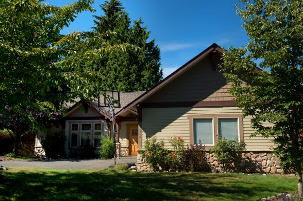
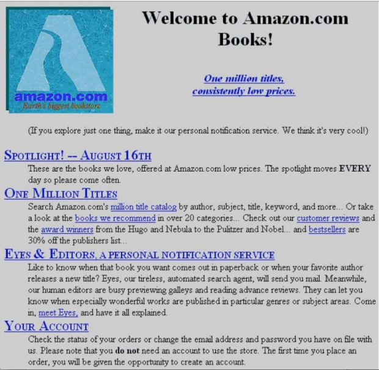
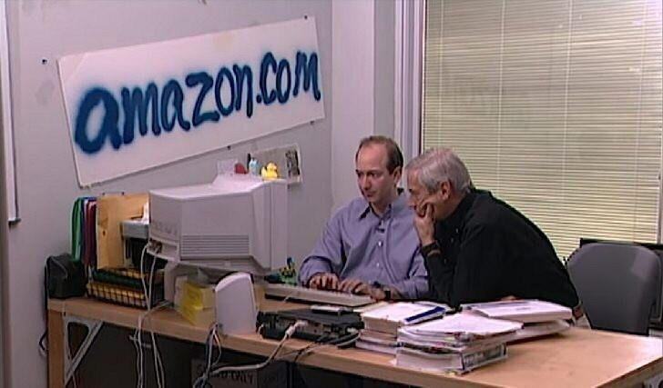
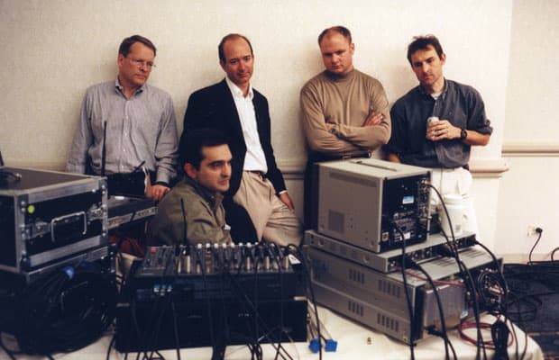
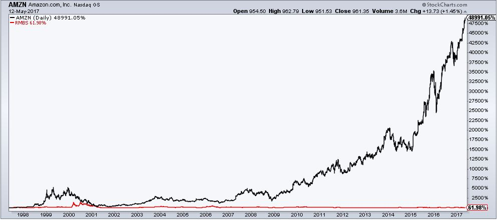
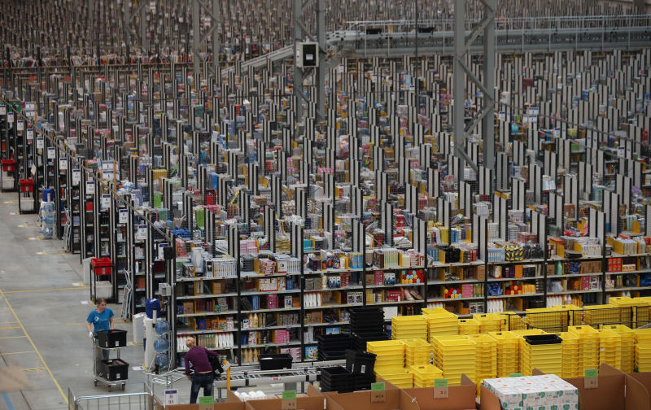
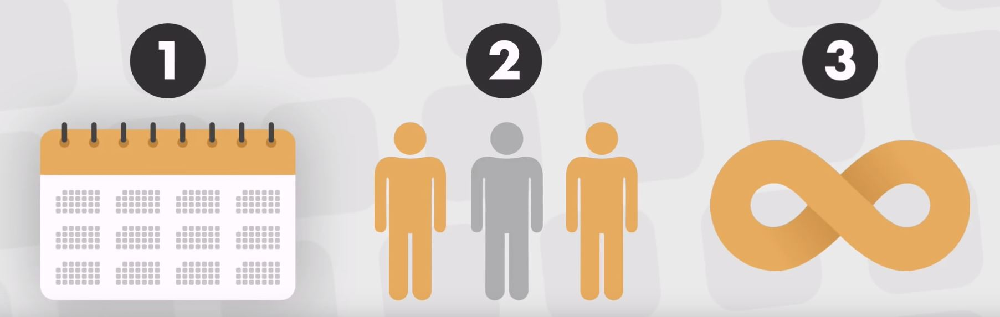

Decade ago the idea of browsing online for almost anything that you want and having it delivered to your doors and the same day would be a dream. Today Amazon.com is doing that in Europe and the United States on a daily basis. The company sell **606 million** products in a year. Amazon has a total of **562,382,292 products** as on Jan 10th, 2018.

Net worth of Jeff Bezos is $150 billion. He is the richest man alive.

## How everything started

Amazon.com started in garage in Seattle by Jeff Bezos. The idea came to him while he was working at the Wall Street company **De Shaw & Co** as the youngest senior **vice president** at investment banking firm.

Bezos sow the potential of the internet in the spring of 1994 he noticed that it was growing by **23,000%** in a year. He was thinking: "If it is growing that fast the question is what kind of business can I do there. He could not sell everything." In order to decide he made a **list of 20 products**. On the end he has chosen books. He said: _"There is literally millions of different books printed in different times. And computers are good at organizing large selection of products."_ The opportunity was there but he had a stable job and good position on Wall Street and quitting that to start something which is very risky was a big decision to make. He created **regret minimization framework** where he was thinking: "If I do this thing and participate in internet and I believe that it can be huge thing, and if I fail would I regret that move and the answer was no. But I also new if I do not try I would always regret that."

So he started form the garage. They have spend a year building the software and infrastructure and they were ready to launch their store on July of 1995. Back than in 100m2 where they were working and having all books. One of his employee said: "I can't figure out is this insanely optimistic or hopelessly pathetisc". None of them they know how the customers are going to react on this new technology.

The way how he financed that year is with the money that he got from his **parents**. He got $300,000 from the family life saving fond. First question that father asked him was "_What is internet_". They didn't bet on internet they wanted to invest in their son.
Jeff explained to them that there is 70% of chance that they will lose the money. But they backed him up anyway.

Bezos originally wanted to give the company magical sounding name **"Cadabra."** Amazon's first lawyer, Todd Tarbert, convinced him that the name sounded too similar to "Cadaver," (dead body) especially over the phone. He finally chose "Amazon" because he liked that the company would be named after the largest river in the world, hence the company's original logo. He knew from the very beginning, he wanted Amazon to be the largest store which can sell everything.

They were taking the orders during the day and packing the books during the night the books would then be driven to the post office the next morning. During the company’s early days, a bell would ring every time a purchase was made on the site, leading employees to gather around and see if anyone knew the purchaser.

Amazon.com has been listed on new website Yahoo which helped sails. In the first month Amazon had sold books to people in all 50 states. They had almost 1 million titles even though only had 2000 in stock at the Seattle.

They have received 1 million dollars investment to grow fast. Motto back then was get big fast.

1997 Amazon had its **IPO** ( initial public offering) raising 54 million dollars and valuing company at a 438 million.

After this they have decided to move to the DVDs and music industry. Between 1998 and 2000 Amazon acquired IMDB Tella Butch and Book pages which gave them strategic access to customers in the UK and German market. They also included toys and electronics.

Bezos predicted 74 million dollars in sales by the year of 2000 if things wen moderately and 144 if things went extremely well. And in 2000 they have sold 1.6 billion dollars.

1999 Jeff Bezos was named the person of the year by Time magazine.

Amazon did not have any profit until the quarter of 2001 where they made five million dollars. Bezos explained that he emphasized customer experience over profits. Everything was going great and they almost failed in 2001. Financial desaster struck in the year of 2001 the .com tech bubble finally burst. Several companies that Amazon had acquired went under and Amazon stock price droped from a hundered and seven dollars to a brutal seven dollars.

Amazon went ito a crises mode and shifted their focus to cutting costs 1,300 employees were laid off and distribution facility was shut down. In 2003 better days came for Amazon and over a couple years they have acquired clothing site, a grocery store and purchase the company audible for 300 million dollars. They have launched Kindle digital reader, and also they have launched Amazon web services.

## Where is Amazon.com today

From 2010 Amazon was going up and up becoming one of the tech giant. In April 2018 Amazon has **563,100 employees** and revenue of **$177.9 billion**. This numbers make Amazon the world's larger internet company by the revenue. As of December 2017, **197 million users** visited Amazon's websites per month.

### Amazon.com mission and vision

**Earth’s biggest selection and to be Earth’s most customer-centric company.**

Jeff Bezos of Amazon explains
There are many ways to center a business. You can be **competitor focused**, you can be **product focused**, you can be **technology focused**, you can be **business model focused**, and there are more. But in my view, obsessive customer focus is by far the most important. Even when they don’t yet know it, customers want something better, and your **desire to delight customers** will drive you to invent on their behalf.

_“Our customers are loyal to us right up until the second somebody offers them a better service,” he says. “And I love that. It’s super-motivating for us.”_

The latest example of innovation in their business model is the launch of Amazon Go, a new kind of store with no checkout required. Boasting a "Just Walk Out Shopping experience",the Amazon Go app users enter the store, take the products they want, and go with no lines and no checkout.

<iframe width="830" height="450" src="https://www.youtube.com/embed/NrmMk1Myrxc" frameborder="0" allow="autoplay; encrypted-media" allowfullscreen></iframe>

### Delivery

<iframe width="830" height="450" src="https://www.youtube.com/embed/4eO6NUgSQ2c" frameborder="0" allow="autoplay; encrypted-media" allowfullscreen></iframe>

<iframe width="830" height="450" src="https://www.youtube.com/embed/MXo_d6tNWuY" frameborder="0" allow="autoplay; encrypted-media" allowfullscreen></iframe>

### Amazon's Advantage

These are the key of amazo advantages over other companies:

1. **Long-turn thinking**
   They are acting in the way what make sanse for three, five, ten years in future.
2. **They focus on customers more than on competitors**
   Main goal is building loyalty even if it means sacrificing profit today.
3. **Remarkable scales** They are building remacable efficiency they are selling billions of packages a year so they can buy their own airplane. Start your own shipping company and lower your prices. **Data** Other online retail sellers do not even come close to the number of salles that Amazon.com has.

### Companies owned by Amazon

1. **IMDB.COM**

Amazon bought the Internet Movie Database back in 1998. Individual pages within the database now have the option to click to buy a DVD or Blu-ray of the film from Amazon. Other than that, it's remained a relatively separate entity since the purchase.

2. **ALEXA.COM**

Not to be confused with Amazon's digital assistant with the same name, Alexa is an analytics provider. Thus, it's used primarily to rank the popularity of websites. Amazon snapped up the service in 1999, in a deal worth $250 million in stock.

<!-- <iframe width="830" height="450" src="https://www.youtube.com/embed/J6-8DQALGt4" frameborder="0" allow="autoplay; encrypted-media" allowfullscreen></iframe> -->

3. **AUDIBLE**

Arguably the most popular repository of audiobooks online, Audible became part of the Amazon empire back in 2008 in a deal that cost Amazon $300 million. Now, when you search for a book on Amazon, you have the option to purchase the Audible narration along with your Kindle e-book at a reduced price; and Amazon Prime members have access to original audio series created by Audible.

<iframe width="830" height="450" src="https://www.youtube.com/embed/m4kEGXdegmk" frameborder="0" allow="autoplay; encrypted-media" allowfullscreen></iframe>

4. **BOX OFFICE MOJO**

The website Box Office Mojo has been charting the box office performance of movies since 1999, and in July 2008, IMDb (which, we've discussed, is owned by Amazon) bought the service. Thus far, Box Office Mojo has continued to run as its own entity, although in October 2014, traffic for one day was redirected to IMDb's own box office page. This change was reversed within 24 hours, but it's added a question mark to the future of the site.

5. **ABEBOOKS**

Acquired by Amazon in 2008, AbeBooks was and is a site dedicated to tracking down rare, used and out of print books. It works with independent bookstores to ensure a hefty range of titles that otherwise would be hard to find.

6. **ZAPPOS**

If you've ever debated the merits of Zappos over Amazon, we've got some bad news for you: Amazon bought the shoe retailer in 2009 for a whopping $807 million. Since its acquisition, Zappos has remained an independent entity and has worked hard to maintain its individual company culture and values.

7. **GOODREADS**

One of the 350 most popular websites in the world (according to Alexa, at least!), Goodreads is a community of book reviews, recommendations, and discussion. It came to life in December 2006, and was acquired by Amazon in March 2013. While it was a pretty logical purchase for the company, many Goodreads devotees were angered by it because they believed the Amazon affiliation would harm local booksellers (Goodreads users would now be prompted to purchase the books from Amazon, rather than mom-and-pop shops).

8. **DOUBLE HELIX GAMES**

Amazon has snapped up a couple of video game developers throughout its history, including Double Helix Games in 2014. The studio is best known for creating titles such as Killer Instinct and Silent Hill: Homecoming.

9. **TWITCH**

The live video-game streaming platform was snapped up by Amazon in the autumn of 2014 for a cool $970 million, and now, access to Twitch is free with a Prime membership. Google had been circling Twitch beforehand, but it was Amazon that ultimately concluded the deal. Why would a business that is primarily a retailer want a live-streaming service? Business Insider's Matt Weinberger believes the acquisition was a way for Amazon to bolster its Amazon Web Serves division, which focuses on cloud computing.

10. **SHOPBOP**

Trendsetters are likely familiar with the shopping site, which was founded in 2000 and bought by Amazon in 2006. Thanks to the partnership, Shopbop purchases are eligible for Amazon Prime's free two-day shipping.

11. **QUIDSI**

Quidsi might not be a household name, but you've probably heard of (and use) its sites, which include Wag.com (pet supplies), Soap.com (household needs), Diapers.com (baby supplies), and BeautyBar.com (cosmetics). Amazon made Quidsi part of its family in 2010 for $500 million.
