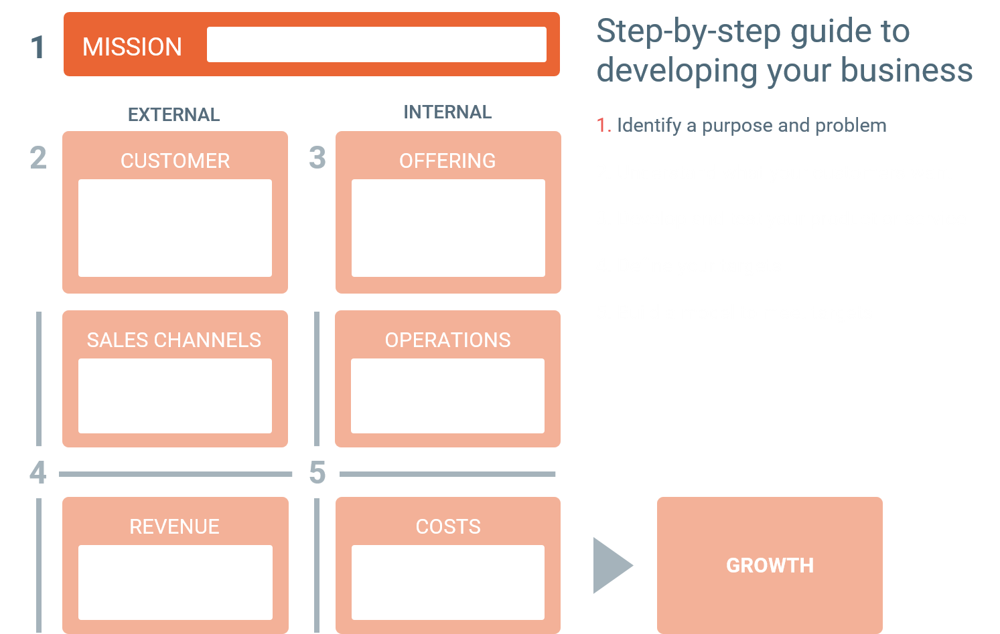
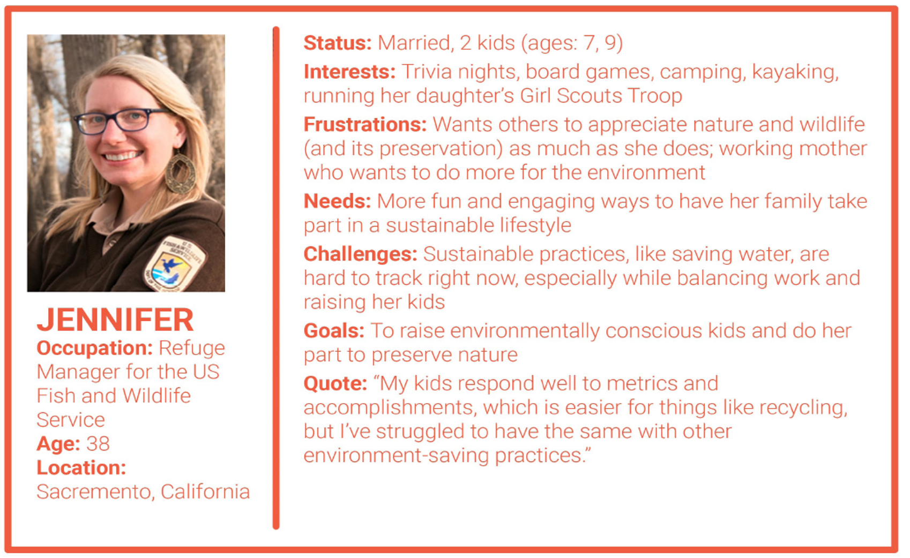
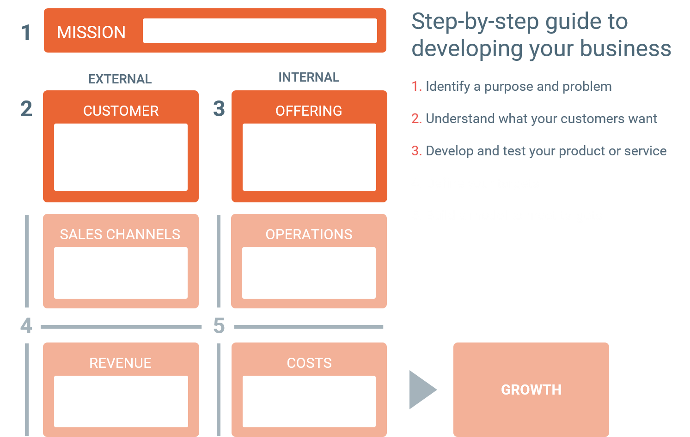
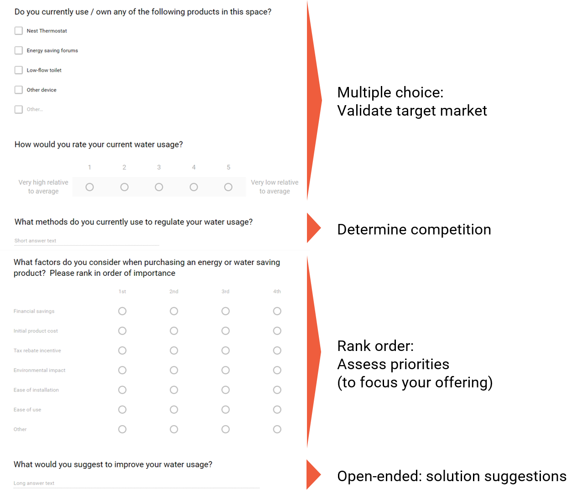
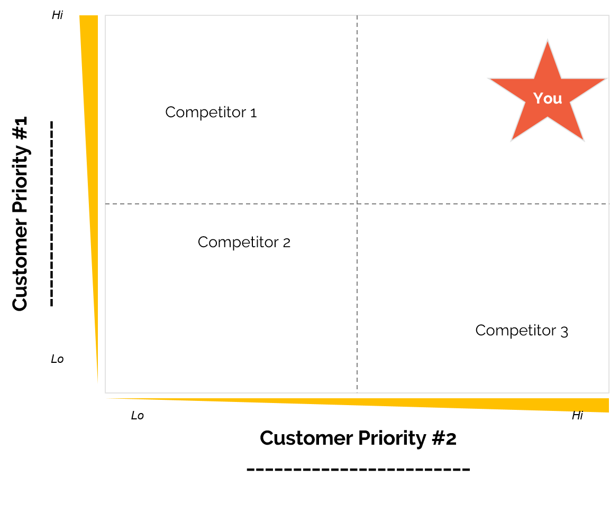
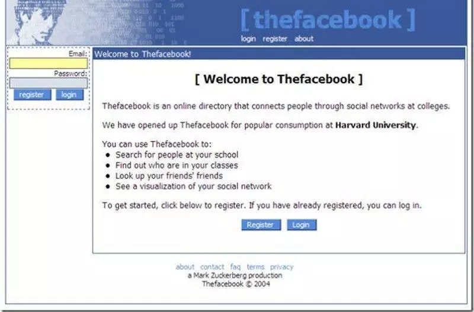

Summary: __Idea__ > __Validation__ > __Customers__ > __ 

##  1. Starting the Journey

### 1.1. What is Entrepreneurship

We can define entrepreneurship as: "Entrepreneurship is the pursuit of opportunity beyond resources controlled."

Let's define each of this terms:

__Pursuit:__ the actions of an individual entrepreneur — drive, resiliency, focus, discipline, and balance.

__Opportunity:__ the type of venture — a better, cheaper, or more efficient offering for the customer.

__Beyond resources controlled:__ managing the risks of external constraints.

<iframe width="830" height="420" src="https://www.youtube.com/embed/QGMitqTS3Lk" frameborder="0" allow="accelerometer; autoplay; encrypted-media; gyroscope; picture-in-picture" allowfullscreen></iframe>

Do you have the mindset to be an entrepreneur? [Check out this article.](https://lauriestach.com/2017/06/28/do-you-have-the-mindset-to-be-an-entrepreneur/)

### 1.2. Entrepreneurial Myths

Here's a bit more on the perceived hurdles:

__Innovation/Idea:__ most ideas have been thought of before, and all will have competition. Success comes down to executing on your idea well and finding the right customers where you can solve their needs better. Think of all your favorite companies, and chances are, there was already someone doing a startup very similar when they founded.

__Time:__ starting a company does take time, and this just comes down to managing your time well. Focus on the things that matter most, and remember that perfect is the enemy of done. Recall also that many great ventures start as side projects, which is why companies like Google allow their employees 20% of their time to work on projects they think will benefit the company. Check out [this article](https://lauriestach.com/2017/09/30/when-to-go-all-in/) for more on when to go all-in with your startup, and [this one](https://lauriestach.com/2017/08/10/overnight-success-isnt-real/) for why the overnight success myth isn't real.

__Team:__ you can do a lot on your own, though when you do go to find teammates, understand the gravity of this decision and what is most important in choosing a great team. [Check out this post for more.](https://lauriestach.com/2016/01/28/finding-the-right-co-founders-for-your-startup/)

__Funding:__ the average amount to start a company is only about $10,000 - $30,000 (depending on the source — Kauffman Foundation estimates $30,000, while the Small Business Association quotes smaller numbers). Most entrepreneurs fund their company either on their own, or with a small loan from friends and family. Media skews what is needed to start something with the few outliers who raise millions of dollars, but the truth is, it usually requires much less.

Plus, [check out this](https://lauriestach.com/2016/06/16/entrepreneurship-can-be-taught/) post for more debunking of some common myths of entrepreneurship.

<iframe width="830" height="420" src="https://www.youtube.com/embed/EI20jqSkYYY" frameborder="0" allow="accelerometer; autoplay; encrypted-media; gyroscope; picture-in-picture" allowfullscreen></iframe>

### 1.3 Questions

__Q1__ You have a great idea for a business and are excited to get to work. You come across a similar business when doing searches online. Which of the following is the only thing you should NOT do at this information?

a) Learn what they did well and integrate aspects of it.

b) Learn ways they haven’t been doing well to know what to avoid.

c) Understand how to differentiate your business incorrect.

d) Change your idea since it’s already being done.

__Q2__ Where does majority of startup funding come from?

a) The entrepreneur’s savings or with a bit of support from friends and family

b) Venture Capitalists (VC’s)

c) Angel Investors

d) Bank loans

__Q3__ What is a common characteristic of entrepreneurs?

a) Dropped out of school

b) Extremely wealthy

c) Great salesperson

d) Resilient

__Q4__ Which of the following is most important in entrepreneurship?

a) Idea

b) Market

c) Team

##  2. Identifying Opportunities 

In this section, we will cover:
* Activities to get the creative mind engaged
* Guided brainstorming, focused on identifying problems and opportunities
* Filtering problems to solve based on fit and potential

### 2.1. Introduction to Opportunity Identification 

<iframe width="830" height="420" src="https://www.youtube.com/embed/st_5cvHPWrc" frameborder="0" allow="accelerometer; autoplay; encrypted-media; gyroscope; picture-in-picture" allowfullscreen></iframe>

### 2.2. Creativity Exercise - Two Words

<iframe width="830" height="420" src="https://www.youtube.com/embed/Hr9bDlu4MvM" frameborder="0" allow="accelerometer; autoplay; encrypted-media; gyroscope; picture-in-picture" allowfullscreen></iframe>

### 2.3. Creativity Exercise - Mindmapping

<iframe width="830" height="420" src="https://www.youtube.com/embed/G6XQj48uZds" frameborder="0" allow="accelerometer; autoplay; encrypted-media; gyroscope; picture-in-picture" allowfullscreen></iframe>

### 2.4. Creativity Exercise - The Brick Test

<iframe width="830" height="420" src="https://www.youtube.com/embed/hNdw904l5wQ" frameborder="0" allow="accelerometer; autoplay; encrypted-media; gyroscope; picture-in-picture" allowfullscreen></iframe>

### 2.5. Share Your Creativity Exercise Results
As a reminder, the creativity exercises from the video were:

* Two Words - build a company with the starting point of two random words as the company name.
* Mindmap - use some words from your reflection as a starting point to build a map of the first words that come to mind, then piece some of them together into a potential company.
* Brick - think of as many creative uses for a brick in one minute as you can!

### 2.5. Brainstorming

<iframe width="830" height="420" src="https://www.youtube.com/embed/oDOdsCIPLy4" frameborder="0" allow="accelerometer; autoplay; encrypted-media; gyroscope; picture-in-picture" allowfullscreen></iframe>

### 2.6 Finding Opportunities

Look for ways that current customers of the market aren't fully satisfied with the solutions available, plus look for potential customers who do not have access or skills for current offerings.

__List your own__ underserved needs or frustrations.

__Listen to customers__ in this market about their frustrations.

__Watch your competitors__ both top companies and newly hyped companies in the industry, assessing their strengths and weaknesses. Read online customer reviews of current offerings and identify their biggest unmet needs.

__Assess barriers to being a customer__ to see if there are certain skills, access, awareness, etc. that makes the offering accessible to these customers, but prevent it from being desirable or accessible to others.

### 2.7. Some Reminders for the Process

__As you brainstorm, there are NO BAD PROBLEMS TO SOLVE.__

* Build on concepts — ask “how might this work?” versus “why wouldn’t it work?”
* Write down ALL problems — no matter how silly – they can build to something great!
* Go for quantity — this isn’t the time to be filtering yet — that comes later.

__Avoid:__ 
* Thinking that it's already been done.
* Waiting only for "quality" ideas.
* Focusing on the solution instead of the problem.

### 2.8. Filtering

<iframe width="830" height="420" src="https://www.youtube.com/embed/_3M9X88adJ8" frameborder="0" allow="accelerometer; autoplay; encrypted-media; gyroscope; picture-in-picture" allowfullscreen></iframe>

Our tool for filtering is to check the items roughly against “fit” and “potential”. 

__Fit__ — _be a founding team that others believe in_.
Roughly assess each problem based on how excited you would be to work on it, and whether or not it plays to your strengths. 

__Potential__ — _give confidence that you would be creating value that you can capture_.
Roughly assess each problem based on whether there is a real need with customers who are desperate for a solution. 

Determine which problems score high on both dimensions. Narrow to a few problems through this process, then review these a bit further. Do some research, plus get some outside input. If you find yourself leaning towards one even if it not being the highest ranked, that's fine! Trust your gut over the numbers — this was just a helpful first pass to narrow the list.

There’s no magical formula for the perfect idea, but it’s important to be passionate about what you are working on, have the ability to execute on it, and feel confident in the potential.

__Teaming__

Relationships are hard, and this is especially true in startups, when the ups and downs of the process cause emotions and tensions to run high. Startups are much more likely to fail due to issues within the founding team than any other problem. Sixty-five percent of startup failures result from “people problems,” compared with only thirty-five percent failing for any other reason—including funding, customer acquisition, and product development.

You can minimize interpersonal challenges by finding the right co-founders and setting up expectations for how you’ll work together. The success of a team can be broken down into three parts:

__Design__ - finding the right complementary co-founders.

__Launch__ - setting expectations and norms.

__Process__ - managing the culture relative to norms and expectations.

While you may be tempted to startup your company alone, keep in mind that there can be a lot of potentially valuable reasons to have co-founders: complementing your skills, getting a more well-rounded perspective, having support through the ups and downs of a startup, and more.

More on teaming success available in this [post](https://lauriestach.com/2015/12/20/success-is-all-about-the-people/).

### 2.9 Team Design

Team design is about having the right people—finding cofounders with a similar __vision and values__, and with complementary personalities and skills. Many entrepreneurs start by finding others who have similar interests, like their friends. Instead, entrepreneurs should start look for people who have the same values and reasons for wanting to start a business. Skills can be learned and interests can change, but shared values and motivation create a strong foundation.

1. __Shared vision__ - have a common "why". The best cofounder teams have similar drives for starting their company, and this plays out in their decisions as they develop and grow the business.
2. __Complementary skills__ – we refer to three types: the builder, brander, and business developer

    a) The builder is the technical co-founder and product developer. This may include skills of coding or product prototyping.
  
    b) The brander connects the customer to your offering, including marketing, brand guidelines, and visual design.
  
    c) The business developer is the operations, finance, and sales person. This person hustles to get the right partners and customers.
3. __Shared interests__ - (least important) Once you’ve aligned with compatible teammates around similar values, it becomes surprisingly easier to find common ground to develop business ideas.

### 2.10 Team Launch

Setting up team norms and expectations is the “launch.” Most team issues come down to a misalignment in expectations, so it’s important to set these clearly up front. Know what is important (and not important!) to everyone, how you’ll communicate, when people can make decisions without checking in, whether you’ll work together in the same room or separately, etc.

These discussion topics for the first few meetings that may help reduce friction caused from misalignment:

__Values and motivations:__ Share why you’re interested in the project—what drives each of you and what aspects of the project appeal to you?

__Company vision:__ Ask teammates to share their visions for the future of the company. It’s important to ensure that this isn’t a simple project or app, but that there is a bigger mission around which the team can align.

__Working style:__ Share aspects of your personality and preferences that are relevant to the team settings, as well as your commitments outside of work.

__Roles and responsibilities:__ There are two options here: either assign roles in advance and have specific responsibilities within each role, or assess needs as they arise and assign responsibilities based on skills, interest, and capacity.

 Establish and agree to your team norms: [Download a template here](https://drive.google.com/file/d/0B_OfYWuo44F2c3F4TFVmU2YzQ0k/view).

 
 Check out this post for [more](https://lauriestach.com/2016/04/20/team-launch-its-all-about-setting-expectations/)

 Plus, consider [how to be open to and give good feedback.](https://lauriestach.com/2017/09/20/feedback-learning-growth-how-to-listen-and-how-to-give-it/)

### 2.11 Questions

__Q1__ How might you identify potential ideas?

a) Customer Problems

b) Ah-ha Moments

c) Think Outside the Box

__Q2__ Which is the correct order of doing structured brainstorming?

a) Put yourself in situations that inspire brainstorming like taking a shower

b) Look at cool new startups in the market, think about where else the market is going, and choose the coolest idea

c) Identify your interest areas, explore opportunities of the market, and optimize options for fit and potential

d) Make a list of your strengths, identify markets that are growing, and develop ideas that are at the intersection

##  3. Customers 

“When you’re trying to make an important decision, and you’re divided on the issue, ask yourself: If the customer were here, what would she say?” —Darmesh Shah, HubSpot

The single most important thing any entrepreneur can do is to spend time getting to know their customer. The customer is whoever will be buying your solution, even if there is someone else who would be using it. By developing a deep understanding of your buyer, you can develop a stronger product and business.

In this section, we will cover:
* A case study by Bill Aulet on customer focus
* The forms of market research
* How to prepare for and perform customer interviews
* Choosing your customer

<iframe width="830" height="420" src="https://www.youtube.com/embed/zY22sig0f24" frameborder="0" allow="accelerometer; autoplay; encrypted-media; gyroscope; picture-in-picture" allowfullscreen></iframe>

### 3.1. Video: Case Study

<iframe width="830" height="420" src="https://www.youtube.com/embed/6j4a1CQwlNA" frameborder="0" allow="accelerometer; autoplay; encrypted-media; gyroscope; picture-in-picture" allowfullscreen></iframe>

### 3.2. Potential Research Methods

<iframe width="830" height="420" src="https://www.youtube.com/embed/XJBenvIfqQ4" frameborder="0" allow="accelerometer; autoplay; encrypted-media; gyroscope; picture-in-picture" allowfullscreen></iframe>

### 3.3. Video: Interviews

<iframe width="830" height="420" src="https://www.youtube.com/embed/Js4qoQp1Emo" frameborder="0" allow="accelerometer; autoplay; encrypted-media; gyroscope; picture-in-picture" allowfullscreen></iframe>

### 3.4. Research Methods
__Market research__ is the process of gathering information about your customer’s __needs and preferences__. There are lots of ways to get input from customers. Some include:

__Interviews or observations__ bring depth to the customer frustrations to help you uncover __important opportunities__, and refine the target customer in order to make surveys and internet research more directed and valuable

__Internet research__ most suited towards covering specific topics such as __researching competition__ or learning more about the __market size__.

__Surveys__ most suited towards gathering __quantitative data__ or rankings, such as determining the most important purchasing criteria for a specific group of customers.

There are advantages to each of the different research methods, though the __advantages of interviews__, in particular, makes them most suited to this early stage. Interviews allow you to get actionable insights on customer needs to build an offering of value.

Surveys work best after an initial need is uncovered and verified, so that actionable and pointed questions to your target customers can help you design your product. This will be covered in a later section of the course.

### 3.5. How to Interview
__What NOT To Do__

* Don’t come into a customer interview feeling _you have the answers_. If your idea doesn't adjust at least some based on these conversations, you're not listening.
* Don’t expect customers to have the answer. They'll know their frustrations and needs, but not necessarily how to solve it.
* Do not sell! This is the time to learn, so do NOT mention your specific ideas for how to solve the problem.
* Do not include friends and family in your interviews - you will not get as realistic perspective on the problems.

__What To Do__

* Focus on the need, not the solution!
Beware of confirmation bias — you are NOT there to validate what you think, you are there to uncover a need.
* Do it in person, one at a time — this will allow you to pick up on cues from gestures and facial expressions.
* Ask open-ended questions — this makes it a conversation and allows you to get to more depth of the need you may not have thought about before.
* Get subjects to tell a story.
Listen much more than you talk!
* Follow your nose and drill down (Why? Why?...).
* Understand their priorities.

### 3.6. Choosing a Customer

<iframe width="830" height="420" src="https://www.youtube.com/embed/D-AY3ej5UZw" frameborder="0" allow="accelerometer; autoplay; encrypted-media; gyroscope; picture-in-picture" allowfullscreen></iframe>

__Dropwise Example__

__Interview results / insights example__ 

Renters tend not to have to pay for water usage, so are less likely to implement a solution. Homeowners would prefer to use less water due to:
* Monthly costs
* Environmental impact
* Water shortages
* Homeowners who have the biggest concern of the above are in locations like California, where there has been a drought

__Target customer:__ eco-friendly homeowners in California who install energy- saving products, such as the Nest thermostat.

__Customer Persona__

Develop your own using [this template](https://drive.google.com/file/d/0B_OfYWuo44F2X2gxOS0zMnY1Z3c/view).

### 3.7 Questions: Interviews

__Q1__ Which of the following is a correct strategy in choosing your target customer?

a) A homogeneous group of potential customers in terms of their buying behavior.

b) The "mermaid strategy".

c) Choose a large market so that even if you get only 1% of the market, you can do well.

__Q2__ What is the first market research method you should use early in the research process to explore and validate that there is a real need for your potential idea?

a) Google - see what data is out there that proves that there is a need.

b) Focus group - interview multiple people at once to get validation quickly but directly from potential customers.

c) Interview - ask open-ended questions about use and frustrations to learn more

d) Survey - ask a lot of potential customers efficiently to get lots of quantitative data

__Q3__ Which of the following formats of questions work best for early market research?

a) Scale of 1-5 (or similar numerical scale) to gauge the positive feedback on your idea numerically

b) Open-ended questions about the frustration or use of items in the targeted problem area

c) Open-ended questions about willingness to pay for the potential solution you are proposing

d) Yes / No questions to ensure that there is a clear answer to what you are asking

__Q4__ Which of the following would be a good question to ask during market research?

a) How big is your need for this product?

b) How likely are you to buy this product?

c) What are your biggest frustrations with your current solution?

##  5. Designing Your Offering  

In this section, we will cover:
* Using surveys to determine the most important dimension to your customer
* Competitive positioning
* Developing your value proposition, including your customer, industry, your promise of value, and how you will achieve it.

<iframe width="830" height="420" src="https://www.youtube.com/embed/L5iVu4WJFL8" frameborder="0" allow="accelerometer; autoplay; encrypted-media; gyroscope; picture-in-picture" allowfullscreen></iframe>

### 5.1. Customer v. End User

Often, your customer will be different from the end user, and many early startups make the mistake of optimizing a solution for the end user. Keep in mind that your customer is whoever is paying for the offering, though the person who obtains value from what you develop may be different. Here are a few examples:

* Educational products — the school is the customer while students are often the end users
* Public transportation — governments pay for the solution while commuters are the most common end user
* Corporate products — the business buyer will be the customer while it is usually another person in the organization is the end user

In all of these scenarios, you need to appeal to both the customer and the end user, though optimizing to the needs of the customer is most important.

### 5.2. Example Survey

Note: the most important aspects of the survey are the results that will be actionable, such as having clear preferences and tradeoffs of the customer. Validation of the market and assessment of competition and ideas can be helpful, though they mainly just help refine the image of the customer versus make decisions confidently based on data.

### 5.3. Strategy

<iframe width="830" height="420" src="https://www.youtube.com/embed/D1q9GDlrPyM" frameborder="0" allow="accelerometer; autoplay; encrypted-media; gyroscope; picture-in-picture" allowfullscreen></iframe>

[Click here for a template](https://drive.google.com/file/d/0B_OfYWuo44F2YTJyUDlock5OU1E/view)

### 5.4. Brainstorming Solutions

Refer to your list of the top priorities of your target customer, the person with the biggest burning need in this area. Spend some time coming up with lots of potential ways to provide a solution that optimizes against just those top priorities. This is where it is important to really consider the full breadth of options, and to not just continue with your pre-conceived notion of how the problem may be solved.

Consider the following to prompt the breadth of potential solutions:

* What products do this? Why aspects are helpful to my customers and which are unnecessary? What is missing from these that my customer cares more about than the customers of this product?
* What services support customers with this problem? Are there forums, blogs, softwares, trainings, platforms, apps, consultants, etc. who provide solutions? What are the pros and cons of each? Where are the gaps for the customers I have identified as lacking a solution?

Remember - the existence of competition does NOT mean that there is not an opportunity! In fact, competition shows that there is a real need. Your job is to find a way to better meet the needs of your customers, while seeing what opportunities that your competitors have not learned to meet - including specific customers, marketing channels, scaling challenges, and more.

### 5.5. Value Proposition

<iframe width="830" height="420" src="https://www.youtube.com/embed/Z_FolWI0zBk" frameborder="0" allow="accelerometer; autoplay; encrypted-media; gyroscope; picture-in-picture" allowfullscreen></iframe>

What to do:
* Clearly identify your specific customer
* Use numbers in the benefit, such as "30% less water usage"
* Under promise, over deliver
* Keep it short and simple (just one sentence)

What NOT to do:
* Try to have everyone as your customer
* Framing your industry narrowly as your specific product type
* Having a vague benefit like "better quality"
* Listing too many features that muddles the confidence in your ability to deliver

__Outline for writing a value proposition statement:__

For (target audience),
our company is the brand of (industry or other frame of reference or type of product/service)
that delivers (quantified primary benefit / promise)
through (key attributes / strategy).

### 5.6. Questions: Designing Your Offering

__Q1__ What is a good use of surveys?

a) Showing statistics on how many people have the need

b) Prioritizing the factors that the target customer considers in finding solutions

c) Determining pricing 

__Q2__ Which of the following would be potential competitors of Dropwise?

a) Customers checking their monthly water bill

b) Technician-installed solutions for obtaining real-time water usage data

c) An online community of people who share tips for saving water

d) All of the above

__Q3__ What is the key to competitive differentation?

a) finding out your competitor's stengths and ensuring you integrate all of these features

b) being better than competitors on all the ways that they underserve their customers

c) being better at just the dimensions that matter most to your specific target customer

d) all of the above

##  6. Testing Your Offering     

In this section, we will cover:

* MVP — Minimum Viable Product — and how to develop it
* Customer acquisition — the channels and methods for selling
* Elevator pitches

Important: you will iterate a LOT during this phase of your startup. Your solution will need to change as you get feedback from customers - that's a good thing! If you aren't changing, you aren't learning.

### 6.1. Video: Testing Your Offering - Introduction

<iframe width="830" height="420" src="https://www.youtube.com/embed/HHixVEoMpfc" frameborder="0" allow="accelerometer; autoplay; encrypted-media; gyroscope; picture-in-picture" allowfullscreen></iframe>

### 6.2. Video: Minimum Viable Product

<iframe width="830" height="420" src="https://www.youtube.com/embed/r7Rca7Pmr2Q" frameborder="0" allow="accelerometer; autoplay; encrypted-media; gyroscope; picture-in-picture" allowfullscreen></iframe>

### 6.3. Product Development
1. __Outline__ — Start with a simple sketching or outline, ensuring alignment and getting feedback.
2. __MVP__ — Then, setup a "looks like" test — the offering with some manual workarounds but that still feels the same to the customer.
3. Prototype __Finally__  develop the full prototype after you have gotten feedback from these early tests.

You may ask why there is such a long gap between the First MVP and the Prototype - the reason is that there are multiple iterations on the MVP until a more formalized prototype. The first MVP is rarely the correct version. There will be a lot of learning from it to iterate upon and integrate into multiple more versions before being ready for the prototype. Keep iterating until you feel confident that you have answers to most of the questions about customer behavior that you had at the outset.

[Click here for a template to get started with your MVP.](https://drive.google.com/file/d/0B_OfYWuo44F2WDBlYkNSMnhkZEk/view)

Then, map your product development with [this template.](https://drive.google.com/file/d/0B_OfYWuo44F2QmlGTE5PUk5uYTQ/view)

### 6.4. Video: Customer Acquisition

<iframe width="830" height="420" src="https://www.youtube.com/embed/KI4FgT2WDNM" frameborder="0" allow="accelerometer; autoplay; encrypted-media; gyroscope; picture-in-picture" allowfullscreen></iframe>

Let's calculate some of the standard customer acquisition costs across different types of channels:
* Google Ads have an average cost per website click of $1.50 and average % conversion rate of those website clicks of 2.2%.
* Facebook Ads have an average cost per website click of $0.27 and an average % conversion rate of 1%.
* Let’s assume that mailing flyers will cost 3 minutes of time charged out at $10 per hour, and that flyers have a 1% conversion rate.
* Let’s assume that personal selling through warm introductions and targeted customer outreach requires 10 minutes of time per customer and has a 20% conversion rate.

__Q__ Cost of Customer Acquisition (COCA)

Calculate the COCA for each of the above channels, rounding to the nearest whole dollar amount.

Google Ads:

Facebook Ads:

Mail Flyers:

Personal Seliing:

### 6.5. Elevator Pitch

<iframe width="830" height="420" src="https://www.youtube.com/embed/qYdENxGdcW4" frameborder="0" allow="accelerometer; autoplay; encrypted-media; gyroscope; picture-in-picture" allowfullscreen></iframe>

### 6.6. Recap Questions

__Q1__ Which of the following is an example of your MVP?
a) Manufacturing-ready product design

b) An app with all potential features integrated

c) An initial pilot connecting the customer with end users manually

__Q2__ Which is the proper order of product development?

a) sketching, prototype, MVP

b) sketching, MVP, prototype

c) MVP, sketching, prototype

__Q3__ Which of the following marketing strategies tend to have a higher yield for early startups?

a) customer referrals

b) social media

c) personal selling

d) word of mouth

__Q4__ What is a common MISTAKE of pitching?

a) Listing all of the features

b) Complementing the content with body language

c) Making a clear ask

d) Providing the market size

##  7. Planning Business Logistics 

In this section, we will cover:
* Operations
* High level financials

### 7.1. Operations

<iframe width="830" height="420" src="https://www.youtube.com/embed/kvu4lNT6Vkw" frameborder="0" allow="accelerometer; autoplay; encrypted-media; gyroscope; picture-in-picture" allowfullscreen></iframe>

### 7.2. Business Logistics - Financials: Introduction

<iframe width="830" height="420" src="https://www.youtube.com/embed/G6zKbfSZ8KE" frameborder="0" allow="accelerometer; autoplay; encrypted-media; gyroscope; picture-in-picture" allowfullscreen></iframe>

### 7.3. Business Logistics - Financials: Revenue Models

<iframe width="830" height="420" src="https://www.youtube.com/embed/a8tgA-1VDTI" frameborder="0" allow="accelerometer; autoplay; encrypted-media; gyroscope; picture-in-picture" allowfullscreen></iframe>

### 7.4. Business Logistics - Financials: Pricing

<iframe width="830" height="420" src="https://www.youtube.com/embed/37JLtNXmru0" frameborder="0" allow="accelerometer; autoplay; encrypted-media; gyroscope; picture-in-picture" allowfullscreen></iframe>

### 7.5 Business Logistics - Financials: Sales Projections

<iframe width="830" height="420" src="https://www.youtube.com/embed/50jIXVbGlso" frameborder="0" allow="accelerometer; autoplay; encrypted-media; gyroscope; picture-in-picture" allowfullscreen></iframe>

### 7.6 Video: Business Logistics - Financials: Investment Need

<iframe width="830" height="420" src="https://www.youtube.com/embed/8wHpo-T8rxA" frameborder="0" allow="accelerometer; autoplay; encrypted-media; gyroscope; picture-in-picture" allowfullscreen></iframe>

### 7.7. Financial Calculations

Let's go through a series of calculations for Frank's cookie business.

First, let's determine how much Gross Profit he makes on each batch of cookies.
* One batch is 24 cookies.
* Frank starts by selling cookies for $1 each.
* It costs Frank $10 in materials to make one batch of cookies (sugar, butter, chocolate chips, packaging, etc.)

__Q__ Gross Profit

What is the gross profit per batch of cookies?

__Operational Calculations__

Great! We've found that Frank must invest $10 in materials to gain $14 in gross profit.

Frank discovers a trade show that would be perfect for selling his cookies! He wants to see how many cookies he'll be able to make for the trade show, with the following constraints:

* He can only make cookies for two days in advance of the trade show to make sure they're fresh.
* Each batch of cookies takes 40 minutes and he works for 8 hours per day for the two days in advance of the show.

__Q__ Operations

How many batches of cookies can Frank make for the trade show?   
 
How much will it cost Frank for the materials up front?

__Breakeven Calculation__

Frank is excited to bring his 24 batches of cookies (576 total cookies!) to the trade show.

In addition to the investment in the cookie materials, it will cost Frank the following to have a booth at the trade show:

* $200 fee for the booth
* $60 for booth signage and displays, plus business cards
* $60 for a sales person to help support him during the event
* $30 in travel for gas, tolls, and parking

__Q__ Breakeven

How many batches of cookies does Frank need to sell in order to breakeven on the marketing and sales costs of the booth?

Adapting
Oh no! Frank would need to sell 25 batches of cookies to recover his costs, and he only has 24 batches. So even if he sells out ALL of the cookies, he would still take a loss on the booth. He could see a few options here:

* Consider the event an "investment" and hope that customers will buy more in the future - a very risky strategy that rarely pans out.

* Don't attend the event and find other marketing channels that would have a better payoff - certainly an option, especially if there are a lot of options that you need to assess between.

* Play with the number to see what it would take to make the event make sense - let's start here!

The first thing to test with the numbers is pricing - this can have a huge impact on your profit. Let's say that you start charging $2 per cookie. Keeping the other assumptions the same ($10 / batch of materials, 24 batches capacity, $350 cost of attending the event), what do your numbers look like now?

__Q__ Adapting
Gross profit per batch:

__Other Considerations__

Hooray! Frank can make a profit at the trade show. Or can he? Here's a few things that he should consider before making the decision to attend:

* What portion of his cookies will he expect to sell? Will it change a lot based on the price?
* Are there other costs he hasn't considered yet? What about the cost of using the kitchen to bake, the wear and tear on his kitchen supplies, and the value of his own time?

As a company scales, these hidden costs need to be factored in. Let's assume that Frank sells all of the cookies he brings to the trade show and has a profit of $562. If he were to pay himself for his time, or pay someone else for their time as he needs to make more cookies than he can produce on his own, is this enough profit to cover a reasonable rate?

If preparing for the event, cooking, and running the booth totaled 4 days of work at 8 hours for each day, the profit distributed over these hours would result in him being paid $17.56 per hour. If Frank would be able to hire others to make cookies at the same rate and quality as his cookies, and for a lower rate than $17.56, he would be able to sustain the business at the price of $2 per cookie.

Want to take your financials to the next level?
Use our finances template to start developing your financial projections.

##  8. Wrapping Up Final Quiz

__Q1__ Which of the following is most important in starting a company?

a) Idea

b) Market

c) Team

__Q2__ What are ways you can find potential business ideas? 

a) Waiting for an aha moment

b) Customers needs: customers who are being underserved
 
c) Market trends: copying the coolest things in the market

__Q3__ Which way should you ideally filter potential business ideas to find one on which to work?

a) Ask your friends which one seems coolest

b) Filter for fit with your passions and skills plus market potential

c) Choose the one that you think will make you richest

d) Keep working on a few at the same time until one clearly comes to the top

__Q4__ Which of the following market research methods is the fastest and easiest research method, but has the disadvantage of only yielding generic data?

a) Focus groups

b) Interviews

c) Google or other internet search

d) Surveys

__Q5__ Which questions on tennis products are good to ask early in the market research process?

a) How badly do you need your racket fixed on a scale of 1 to 5?

b) Are you tired of having to pick up tennis balls after matches - yes or no?

c) Walk me through how you prepare for and play your tennis games.

__Q6__ There is a music company that connects musicians (that pay to upload their albums on the platform) to listeners (who listen for free).

Which is the CUSTOMER?

a) The musician

b) The listener

__Q7__ What is a REQUIRED characteristics of a good beachhead market?

a) Homogeneous / similar in buying behavior

b) Really big market potential (market size of >$100M)

c) The richest customers possible

__Q8__ Which of the following is NOT true of a customer persona?

a) It is who has the biggest need

b) It is within your target market

c) It is ideally a list of 3-5 people

__Q9__ How do you go about ensuring you do not over-invest on your MVP?

a) Choose the features that are easiest to implement

b) Choose the features that will have the highest impact on the priorities of your customer

c) Combination of the above

d) Neither of the above

__Q10__ Rank in order of importance for company vision (number from 1-3)
* Why - your mission
* What - the tactics
* How - your strategy

__Q12__ You’re a new startup trying to make your first sales. If you had to choose only one of the following strategies, which one typically has the highest payoff?

a) Flyers

b) Social Media

c) Personal Selling

d) Email campaign

__Q13__ Bill wants to get input on his business idea from his friends. Which of the following should he do?

a) He should start by asking them questions about the problem he’s solving

b) He should tell them about his entire product and all the cool things about how it works, then ask if they like it

c) He should get the idea patented before telling others so they don’t steal it

d) He shouldn’t tell anyone his idea

__Q14__ Which of the following is a part of good pitches?

a) Using lots of jargon or acronyms

b) Starting with “why” (the mission)

c) Covering ALL potential risks

__Q15__ Statistically, which of the following has the greatest impact on the success of your communication?

a) Content

b) Tone

c) Body Language

d) Gender
