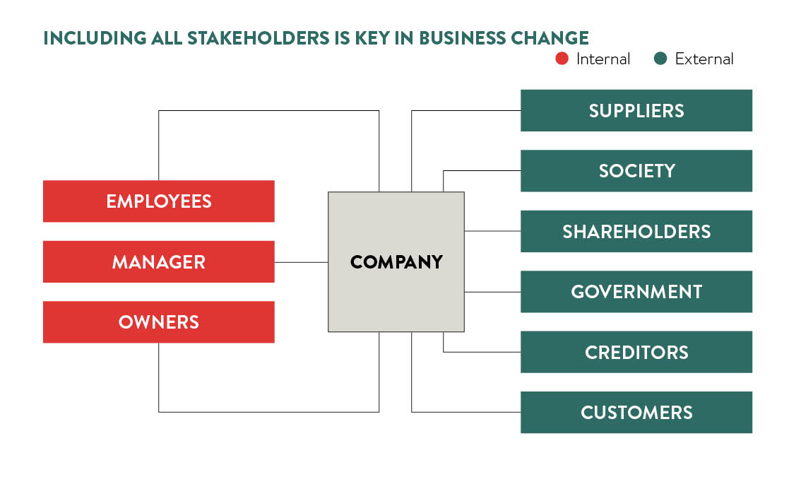
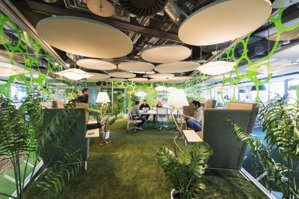
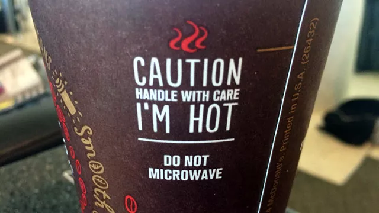
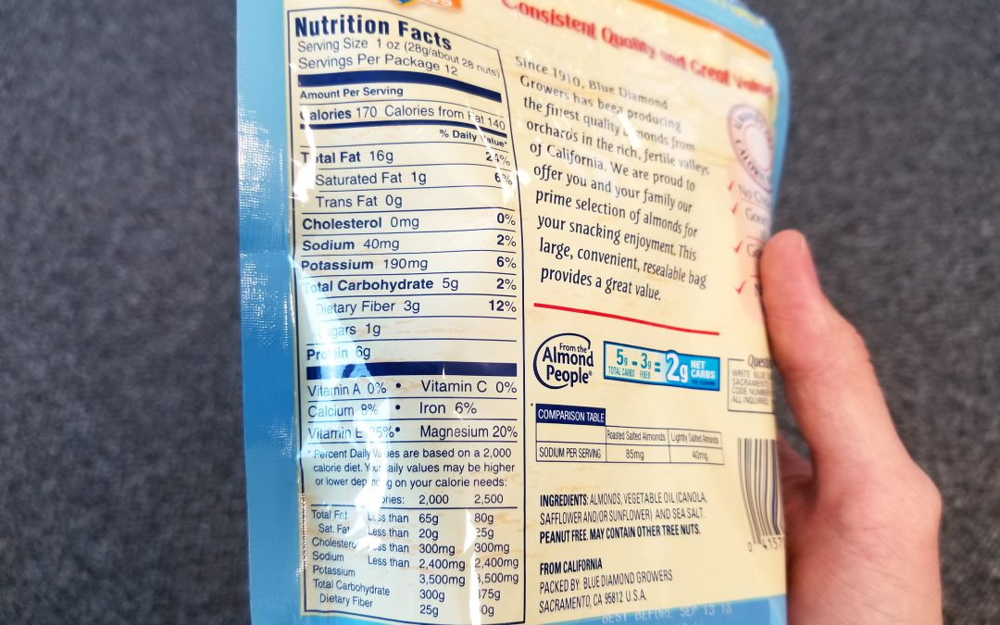
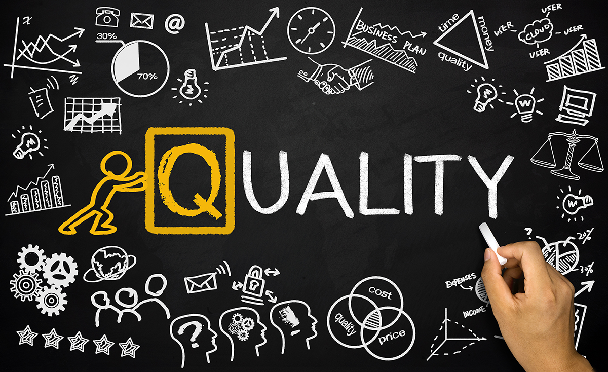

<!-- //write an intro
//## Defining Ethics -->

<!-- stefan.lastric@stu.ibu.edu.ba
    elevejt@gmail.com aldin.berisa@stu.ibu.edu.ba -->
    
__Ethics__ refers to sets of beliefs about right and wrong, good and bad; business ethics involve the application of these issues in the workplace. Clearly, ethics relate to individuals and their day-to-day decision making. The decisions of each individual can affect the entire organization.

A given country’s legal system provides a solid starting point for examining ethical standards. The function of laws elsewhere is to establish and enforce ethical norms that apply to everyone within our society. __Laws provide basic standards of behavior__. But truly ethical behavior goes beyond the basics. In other words, your actions can be completely legal, yet still unethical. But since the legal system is far from perfect, in rare instances your actions can be illegal, yet still ethical.

_The Kala Dera_ is a large village in India. Agriculture is th primary source of livelihood. Coca-Cola started its bottling operations in Kaladera in 2004, and within a year, the community started to notice a rapid decline in groundwater levels. Kaladera lies in an overexploited graudwater area and access to water has been difficult. The problem was especially visible in the summer, villagers had intense water shortages and Coca-Cola hed a highest peak in production. Villagers challenge the Coca-Cola for the worsening water conditions and demanded the closure of the company. Coca-Cola did not wabnt to close their bottling operations and they spend 2.5B annually on public relations, attempting to convince the public that it has responsible practices and is investing in water conservation efforts. It failed and had to close this facility.

<!-- Social responsibility is the obligation of a business to contribute to society. The most socially responsible firms feature proactive policies that focus on meeting the needs of all their stakeholders — not just investors but also employees, customers, the broader community, and the environment. The stance of a company regarding social responsibility sets the tone for the organization and clearly influences the decisions of individual employees.

Although this chapter discusses ethics and social responsibility separately, keep in mind that the two areas have a dynamic, interactive relationship that plays a vital role in building both profitable businesses and a vibrant community. -->

## Creating and Maintaining an Ethical Organization

Research from the Ethics Resource Center (ERC) suggests that organizational culture has more influence than any other variable on the ethical conduct of individual employ- ees. According to the ERC, key elements of a strong culture include displays of ethics-related ac- tions at all levels of an organization and accountability for actions. The impact of these elements can be dramatic.

A strong organizational culture works in tandem with formal ethics programs to create and maintain ethical work environments. A __written code of ethics__ is the cornerstone of any formal ethics program. The purpose of a written code is to give employees the information they need to make ethical decisions across a range of situations. Clearly, an ethics code becomes even more important for multinational companies, since it lays out unifying values and priorities for divisions that are rooted in different cultures. But a written code is worthless if it doesn’t reflect living principles. An effective code of ethics flows directly from ethical corporate values and leads directly to ongoing com- munication, training, and action.

To bring a code of ethics to life, experts advocate a forceful, integrated approach to ethics that virtually always includes the following steps:

1. Get executive buy-in and commitment to follow through. __Top managers__ need to communicate — even over communicate — about the importance of ethics. But talking works only when it’s backed up by action: senior management must give priority to keeping promises and leading by example.

2. __Establish expectations for ethical behavior__ at all levels of the organization, from the CEO to the nighttime cleaning crew. Be sure that outside parties such as suppliers, distributors, and customers understand the standards.

3. Integrate ethics into mandatory __staff training__. From new employee orientation to ongoing training, ethics must play a role. Additional, more specialized training helps employees who face more temptation (e.g., purchasing agents, overseas
sales reps).

4. Ensure that your ethics code is both __global and local__ in scope. Employees in every country should understand both the general principles and the specific applications. Be sure to trans- late it into as many languages as necessary.

5. Build and maintain a clear, trusted __reporting structure__ for ethical concerns and violations. The structure should allow employees to seek anonymous guidance for ethical concerns and to report ethics violations anonymously.

6. Establish protection for __whistle-blowers__, people who report illegal or unethical behavior. Be sure that no retaliation occurs, in compliance with both ethics and the __Sarbanes-Oxley Act__. Some have even suggested that whistle-blowers should receive a portion of the penalties levied against firms that violate the law.

7. __Enforce the code of ethics__. When people violate ethical norms, companies must respond immediately and—whenever appropriate — publicly to retain employee trust. Without enforcement, the code of ethics becomes meaningless.

## Defining Social Responsibility: Making the World a Better Place

__Social responsibility__ is the obligation of a business to contribute to society. Similar to ethics, the broad definition is clear, but specific implementation can be complex. Obviously, the number-one goal of any business is __long-term profits__; without profits, other contributions are impossible. But once a firm achieves a reasonable return, the balancing act begins: How can a company balance the need to contribute against the need to boost profits, especially when the two conflict? The answer depends on the business’s _values_, _mission_, _resources_, and _management philosophy_, which lead in turn to its position on social responsibility. 

Example: Google sent some of their employees to _Africa_ to teach people valuable skills, such us programming, finance, management, engineering. This is also part of the google mission: _"To share and make information available."_

### The Stakeholder Approach:

_Stakeholders are any groups that have a stake or a personal interest in the performance and actions of an organization_. Different stakeholders have __different needs__, __expectations__, and __levels of interest__. The federal government, for instance, is a key stakeholder in pharmaceutical companies but a very minor stakeholder in local art studios. The community at large is a key stakeholder for a _coffee shop_ chain but a minor stakeholder for a web design firm.

Enlightened organizations identify key stakeholders for their business and consider stakeholder priorities in their decision making. The goal is to balance their needs and priorities as effectively as possible, with an eye toward building their business over the long term. Core stakeholder groups for most businesses are employees, customers, investors, and the broader community.

__Responsibility to Employees:__ Creating Jobs that work alone aren’t enough. The starting point for socially responsible employers is to meet legal standards, and the requirements are significant. Employers must comply with laws that include __equal opportunity__, __workplace safety__, __minimum-wage__, and __protection from sexual harassment__. 

Socially responsible employers go far beyond the law. They create a workplace environment that respects the dignity and value of each employee. They ensure that hard work, commitment, and talent pay off.

Example in Google they serve organic and healthy food everywhere and changed it on a daily bases taking care of the _employees nutrition_. When family get child they receive _$500 in benefits_.They do your _laundry_. You have free _car wash_ and oil change. Special places for all _religion_. They have _gym in every building_, and swimming pools, during the summer they organize _running competitions_. You can decorate your office the way you want. This are some examples what Google is doing for their most important stakeholder their employees. Here are examples of some offices that they have:

__Responsibility to Customers__: __Value__, __Honesty__, and __Communication__. One core responsibility of business is to deliver consumer value by providing quality products at fair prices.

_The Right to Be Safe:_ Businesses are legally responsible for injuries and damages caused by their products — even if they have no reason to suspect that their products might cause harm. This makes it easy for consumers to file suits. In some cases, the drive to avert lawsuits has led to absurdities such as the warning on some coffee cups: _“Caution! Hot  coffee is hot!”_ (No kidding…)

_The Right to Be Informed:_ The law requires firms in a range of industries — from mutual funds, to groceries, to pharmaceuticals — to provide the public with extensive information. The Food and Drug Administration, for instance, mandates that most grocery foods feature a very specific __“Nutrition Facts” label__. Beyond legal requirements, many firms use the __Web__ to provide a wealth of extra information about their products. KFC, for example, offers an interactive Nutrition Calculator that works with all of its menu items (and it’s fun to use, too).

_The Right to Choose:_ Freedom of choice is a fundamental element of the capitalist U.S. economy. Our economic system works largely because consumers freely choose to purchase the products that best meet their needs. As businesses compete, consumer value increases. Socially responsible firms support consumer choice by following the laws that prevent anticompetitive behavior such as predatory pricing, collusion, and monopolies.

_The Right to Be Heard:_ Socially responsible companies make it easy for consumers to express legitimate complaints. They also develop highly trained customer service people to respond to complaints. In fact, smart businesses view customer complaints as an opportunity to create better products and stronger relationships. Statistics suggest that 1 in 50 dissatisfied customers takes the time to complain. The other 49 quietly switch brands. By soliciting feedback, you’re not only being responsible but also building your business.

_Delivering quality products_ is another key component of social responsibility to consumers. Planned obsolescence — deliberately designing products to fail in order to shorten the time between consumer repurchases—represents a clear violation of social responsibility. In the long term, the market itself weeds out offenders. After all, who would repurchase a product that meets a premature end? But in the short term, planned obsolescence thins consumer wallets and abuses consumer trust. 

When businesses do make mistakes, apologizing to consumers won’t guarantee renewed sales. But a sincere apology can definitely restore a company’s reputation, which can ultimately lead to greater profits. Three examples make this point clear:

Apple Angst: Apple introduced the iPhone on June 29, 2007, to rave reviews and stellar sales, despite the $599 price tag. But two months later, Apple dropped the price of the phone by $200 to expand the user base further. Not surprisingly, early adopters were livid—why, they demanded, did Apple repay their trust and support by ripping them off? CEO Steve Jobs quickly apologized and offered every $599 iPhone customer a $100 Apple store credit. The response seemed to work. In 2008, Apple’s ranking in the American Customer Satisfaction Index climbed 8%, a full 10 percentage points ahead of its nearest competitor, maintaining a dramatic lead through 2011.

The primary __responsibility of business to investors__ is clearly to make money — to create an ongoing stream of profits. But companies achieve and maintain long-term earnings in the context of responsibility to all stakeholders, which may mean trading short-term profits for long-term success. Responsibility to investors starts by meeting legal requirements but beyond legal requirements, companies have a number of additional responsibilities to investors. __Spending money__ wisely would be near the top of the list.

__Responsibility to the Community:__ Business and the Greater Good Beyond increasing everyone’s standard of living, businesses can contribute to society in two main ways: __Corporate Philanthropy__ and __Corporate Responsibility__.

_Corporate philanthropy_ includes all business __donations__ to nonprofit groups, including both money and products. The Giving USA Foundation reported that total corporate donations increased 13.7% in 2014, a banner year for giving across all sources (perhaps due to the improved economy) It also includes donations of employee time; in other words,some companies pay their employees to spend time volunteering at nonprofits. 

Some companies contribute to nonprofits through cause-related marketing. This involves a partnership between a business and a nonprofit, designed to spike sales for the company and raise money for the nonprofit. Unlike outright gifts, these dollars are not tax deductible for the company, but they can certainly build the company’s brands.

_Corporate responsibility_ relates closely to philanthropy but focuses on the __actions of the business itself__ rather than donations of money and time. In 2013, Starbucks announced a strategic commitment to hire and develop at least 10,000 U.S. military veterans and active-duty spouses over the next five years, in response to its record growth. Taking a different approach to corporate responsibility. Free meal example.

__Responsibility to the Environment:__ Protecting the environment is perhaps the most crucial element of responsibility to the community. Business is a huge consumer of the world’s limited resources, from oil, to timber, to fresh water, to minerals. In some cases, the production process decimates the environment and spews pollution into the air, land, and water, sometimes causing irreversible damage. And the products created by business can cause pollution as well, such as the smog generated by cars and the sometimes-toxic waste caused by junked electronic parts. The government sets minimum standards for environmental protection at the federal, state, and local levels. But a growing number of companies are going further, developing innovative strategies to build their businesses while protecting the environment. Many have embraced the idea of __sustainable development__: doing business to meet the needs of this generation without harming the ability of future generations to meet their needs. This means weaving environmentalism throughout the business decision-making process. Since sustainable development can mean significant long-term cost savings, the economic crisis may even push forward environmentally friendly programs. The results of sustainability programs have been impressive across a range of industries. McDonald’s, for instance, produces mountains of garbage each year, as do virtually all major fast-food chains. But the Golden Arches stands above the others in its attempts to reduce the problem. Following are some encouraging statistics:

* By the end of 2008, McDonald’s UK was recycling 100% of its used cooking oil for biodiesel to fuel delivery trucks. This equates to 1,500 family cars being removed from the road each year.

A growing number of companies use __green marketing__ to promote their businesses. This means marketing environmental products and practices to gain a competitive edge. Patagonia, for example, markets outdoor clothing using 100% organic cotton and natural fibers such as hemp. But green marketing represents a tough challenge: while most people support the idea of green products, the vast majority won’t sacrifice price, performance, or convenience to actually buy those products. Sometimes, however, green marketing can be quite consistent with profitability. The Toyota Prius hybrid car offers an interesting example. The Prius costs several thousand dollars more than a standard car, but as gas prices skyrocketed through the summer of 2008, consumers flooded the dealerships, snapping up Prius hybrids faster than Toyota could ship them. Yet, when the economy dropped in late 2008, Toyota sales plummeted along with the rest of the industry, suggesting that the environment may be a fair-weather priority for consumers. But by 2012, Prius sales again were soaring, especially with the introduction of the plug-in hybrid version

### Ethics and Social Responsibility in the Global Arena: A House of Mirrors?

Globalization has made ethics and social responsibility even more complicated for workers at every level. __Bribery__ and __corruption__ are among the most challenging issues faced by companies and individuals that are involved in international business. Transparency International, a leading anti corruption organization, published its yearly index of “perceived corruption” across 168 countries in 2015. No country scored a completely clean 100 out of 100, and the United States scored a troubling 76, which was quite a bit higher than India at 38 and China at 37, but lower than most of the European countries that dominated the top of the list. Not surprisingly, the world’s poorest countries fall largely in the bottom half of the index, with African and Central Asian countries clustered at the very bottom, suggesting that rampant corruption is part of their business culture. Corruption wouldn’t be possible if companies didn’t offer bribes, so Transparency International also researched the likelihood of firms from industrialized countries to pay bribes abroad. 

In the early 1990s, Levi Strauss “discovered that two of its suppliers in Bangladesh were employing children under the age of 14 — a practice that violated the company’s principles but was tolerated in Bangladesh. Forcing the suppliers to fire the children would not have ensured that the children received an education, and it would have caused serious hardship for the families depending on the children’s wages. In a creative arrangement, the suppliers agreed to pay the children’s regular wages while they attended school and to offer each child a job at age 14. Levi Strauss, in turn, agreed to pay the children’s tuition and provide books and uniforms.” This creative solution allowed the suppliers to maintain their valuable contracts from Levi Strauss, while Levi Strauss upheld its values and improved the quality of life for its most vulnerable workers. Clearly, codes of conduct work best with monitoring, enforcement, and a commitment to finding solutions that work for all parties involved. 