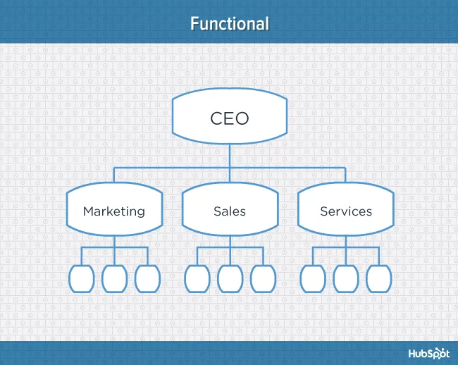
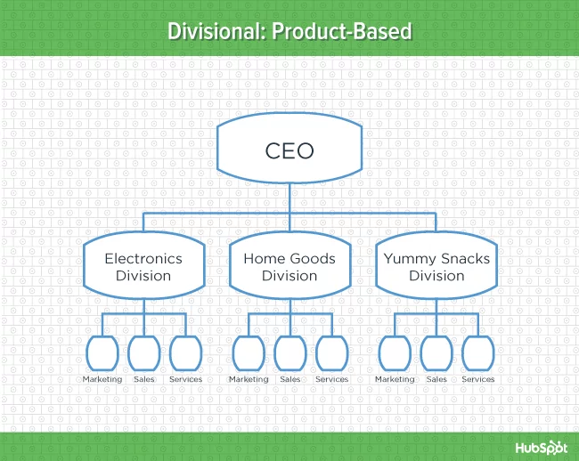
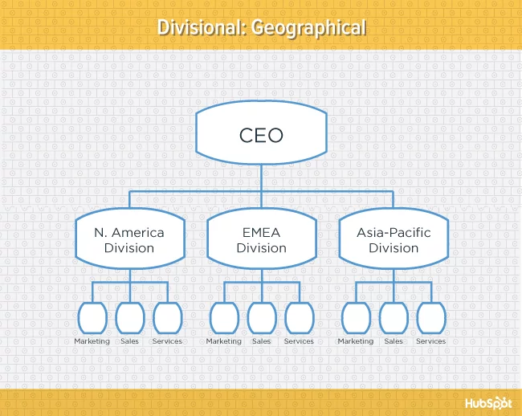

To grow and thrive, every business needs resources—money, technology, materials—and an economic system that helps enterprise flourish. But those resources, or factors of production, are nothing without management to bring them to life. Managers provide _vision_ and _direction_ for their organizations, they decide how to use resources to achieve goals, and they inspire others — both inside and outside their companies — to follow their lead. By formal definition, _managers achieve the goals of an organization through planning, organizing, leading, and controlling organizational resources, including people, money, and time_.

In simple terms, _planning_ means figuring out where to go and how to get there. _Organizing_ means determining a structure for both individual jobs and the overall organization. _Leading_ means directing and motivating people to achieve organizational goals. And _controlling_ means monitoring performance and making adjustments as needed.

In today’s chaotic, hyper competitive business environment, managers face daunting challenges. But for the right people, management
positions can provide an exhilarating — though sometimes
exhausting — career. As the business pace accelerates and the environment
continues to morph — especially in the wake of economic
turmoil — the role of management is also radically
transforming. The successful manager has changed from
boss to coach, from disciplinarian to motivator, from dictator
to team builder. But the bottom-line goal remains the
same: to create value for the organization.

### Management Hierarchy: Levels of Responsibility

Most medium-sized and large companies have three basic
levels of management: **top management, middle management, and first-line (or supervisory) management**. The levels typically fall into a pyramid of
sorts, with a small number of top managers and a larger
number of supervisory
managers. Responsibilities shift
as managers move up the hierarchy, and the skills that
they use must shift accordingly. Here are the differences
between three key levels:

**Top management**
sets the overall direction
of the firm. Top
managers must articulate
a vision, establish
priorities, and allocate
time, money, and other
resources.
Typical titles
include chief executive
officer (CEO), president,
and vice president.

**Middle management**
manages the managers. Middle managers must communicate up and down
the pyramid, and their primary contribution often involves
coordinating teams and special projects
with
their peers from other departments. Typical titles
include director, division head, and branch manager.

**First-line (supervisory) management** manages
the people who do the work. First-line managers
must train, motivate, and evaluate nonmanagement
employees, so they are heavily involved in day-to-day production issues.
Typical titles include
supervisor, foreman,
and section leader.

Smaller companies
usually don’t have a hierarchy
of management. Often
the owner must act as the
top-, middle-, and first-line
manager, all rolled into
one. This clearly requires
enormous flexibility and
well-developed management
skills.

## Motivation : Lighting the Fire

Standout managers motivate others to reach for their best
selves—to accomplish more than they ever thought possible.
Motivated workers tend to feel great about their jobs,
and workers who feel great tend to produce more. But the
thinking about how to motivate workers has changed
dramatically
over time. In the early 1900s, key management
thinkers focused on efficiency and productivity, dictating
precisely how workers should do each element of their jobs. But more recent research suggests that people’s
thoughts and feelings play a vital role in motivation, which
leads to a range of new theories.

### Theories of Motivation

**Maslow’s Hierarchy of Needs Theory** Noted psychologist
Abraham Maslow theorized that people are motivated
to satisfy only unmet needs. He proposed a hierarchy
of human needs — from basic to abstract — suggesting
that as each need is met, people become motivated
to meet the next-highest need in the pyramid. Maslow’s five
specific needs are shown in the following picture:

While his theory
was not based on the workplace, Maslow’s ideas can illuminate
the needs behind motivation at work.
From a workplace
perspective, the idea that
people are motivated only
by unmet needs clearly
holds true for the first two
levels of the hierarchy. Finding
a job that pays the bills,
for instance, is the primary
motivator for most people
who don’t have any job at
all. People who have a job
but no healthcare would
find health insurance much
more motivating than, say, a
company picnic geared toward
meeting social needs.
But after physiological
and safety needs are
met, the other needs are motivating to different degrees in different people. An employee
with strong social connections outside work might
be more motivated by a promotion that meets esteem
needs than by a company outing that meets social needs.
A number of firms actually use self-actualization needs as
a starting point for motivating employees, by creating a
mission statement that communicates the importance of
the work. The House of Blues inspires employees through
its lofty purpose: to promote racial and spiritual harmony
through love, peace, truth, righteousness, and nonviolence.

## Motivation Today

A growing emphasis on corporate culture has captured
the best of both worlds for companies that do it
right. A look at Fortune magazine’s 100 Best Companies
to Work for in 2016 demonstrates that a distinctive, positive
culture tends to create productive employees who
are deeply attached to their work and their companies.
The winners tend to emphasize the health and well-being
of their employees and to offer strong commitments to
make the world a better place.

<iframe width="830" height="420" src="https://www.youtube.com/embed/PA54HWLZ2e4" frameborder="0" allow="accelerometer; autoplay; encrypted-media; gyroscope; picture-in-picture" allowfullscreen></iframe>

Google, which has been on the list for ten years and in the number one slot for seven years, offers employees a famous set of perks at their Silicon Valley headquarters, including on-site haircutting, massage services, game facilities, and 25 cafés companywide, all free. As one happy Googler writes, “The company
culture truly makes workers feel they’re valued and
respected as a human being, not as a cog in a machine.”
Despite—or perhaps in part because of the pricey perks—
everything at Google is up: revenue, profits, share price,
paid search clicks, and hiring. Googlers nearly uniformly
praise the competence of their leadership, the support
they receive as professionals, and the pride they take in
the challenging work they accomplish together. “Simply
by being here, I feel very naturally motivated to be (and
also very proud to be) my best possible self,” explains one
employee.

Riot Games, maker of League of Legends, welcomes new employees
with an intensive immersion that starts with a session
of gaming. If new hires decide that the company is not
a fit before the end of their first 60 days, they are offered up
to 10% of their annual salary (up to $25,000) as an incentive
to quit. As part of its open paid-time-off policy, Riot places
no limit on vacation or sick days spent outside of the office.

## Planning: Figuring Out Where to Go and How to Get There

The planning function—figuring out where to go and
how to get there—is the core of effective management.
A survey in the Wall Street Journal found that 80% of
executives identify planning as their **most valuable management tool**. But even though planning is critical,
it’s also highly risky in light of cutthroat competition, rapid change, and economic uncertainty. The best plans keep
the organization on track without sacrificing flexibility
and responsiveness; they incorporate ways to respond to
change both inside and outside the organization.

<iframe width="830" height="420" src="https://www.youtube.com/embed/oQ238gb64wA" frameborder="0" allow="accelerometer; autoplay; encrypted-media; gyroscope; picture-in-picture" allowfullscreen></iframe>

Although all managers engage in planning, the
scope of the process changes according to the manager’s
positions are: Top-level managers focus on **strategic
planning**. They establish
a vision for the company,
define long-term objectives
and priorities, determine
broad action steps and allocate resources. Middle managers focus on
**tactical planning**, or applying the strategic plan to their specific areas of responsibility. And first-line managers focus
on **operational planning**, or applying the tactical
plans to daily, weekly, and monthly operations. Successful
firms often encourage a flow of feedback up and down
the organization to ensure that all key plans are sound and
that all key players “buy in.”

A fourth category of planning has gained new prominence
in the past decade: **contingency planning**, or
planning for unexpected events. Senior management usually
spearheads contingency planning but with input from
the other levels of management. Contingency plans consider
what might go wrong—both inside the business and
with the outside environment—and develop responses. Clearly, anticipating
every potential problem
is impossible (and impractical).
Instead, effective
contingency plans
tend to focus only on the
issues that are most probable,
most potentially
harmful, or both.

### Strategic Planning: Setting the Agenda

Strategic planning is the most fundamental part of the
planning process, since all other plans—and most major
management decisions—stem from the strategic plan. The
strategic planning process typically includes these steps:

1. Define the mission of the organization.
2. Evaluate the organization’s competitive position.
3. Set goals for the organization.
4. Create strategies for competitive differentiation.
5. Implement strategies.
6. Evaluate results, and incorporate lessons learned.

####Defining Your Mission
The mission of an organization articulates its essential reason for being. The
mission defines the organization’s purpose, values, and
core goals, providing the framework for all other plans. Most large companies present their mission
as a simple, vivid, compelling statement that everyone involved with the company—from the janitor to the CEO,
from customers to investors—can easily understand. Mission
statements tend to vary in their length, their language,
and even their names, but they share a common goal: to
provide a clear, long-term focus for the organization.

 McDonald's brand mission is to be customers' favorite place and way to eat and drink. 

Amazon.com vision is to be earth's most customer-centric company; to build a place where people can come to find and discover anything they might want to buy online.

Nike's mission is, to bring inspiration and innovation to every athlete in the world. If you have a body, you are an athlete. 

#### Evaluating Your Competitive Position

Strategy means nothing in a vacuum—every firm must plan
in the context of the marketplace. Many companies use a
**SWOT analysis** (strengths, weaknesses, opportunities, and threats) to evaluate where they stand relative to the
competition. Strengths and weaknesses are internal to the
organization, and they include factors that would either
build up or drag down the firm’s performance. Opportunities
and threats are external, and they include factors that would
affect the company’s performance but are typically out of
the company’s control.
Initial information about internal strengths and weaknesses
usually comes from careful analysis of internal reports
on topics such as budget and profitability. But to
better understand strengths and weaknesses, executives
should actively seek firsthand information—on a personal
basis—from key people throughout the company, from
front-line workers to the board of directors.
Gathering information about external opportunities
and threats can be more complex, since these areas
include both current and potential issues (which can be
tough to predict). Information about external factors can
come from many different sources, including the news,
government reports, customers, and competitors.

#### Setting Your Goals

Strategic goals represent concrete benchmarks that managers can use to measure performance in each key area of the organization. They must fit the firm’s mission and tie directly to its competitive position. The three most effective goals are:

1. **Specific and Measurable:** Whenever possible, managers
   should define goals in clear numerical terms that
   everyone understands.
2. **Tied to a Time Frame:** To create meaning and
   urgency,
   goals should be linked to a specific deadline.
3. **Realistic but Challenging:** Goals that make people
   stretch can motivate exceptional performance.

#### Creating Your Strategies

Strategies are action
plans that help the organization achieve its goals by forging
the best fit between the firm and the environment.
The underlying aim, of course, is to create a significant
advantage versus the competition. Sources of competitive
advantage vary, ranging from better product quality,
to better technology, to more motivated employees. The
most successful companies build their advantage across
several fronts. Southwest Airlines, for example, has a more
motivated workforce and a lower cost structure. H&M has
lower prices and more fashionable clothing choices. And
Procter & Gamble has more innovative new products and
strong core brands.
The specifics of strategy differ by industry and by
company, but all strategies represent a roadmap. The
SWOT analysis determines the starting point, and the
objectives signify the immediate
destination. Since
speed matters, you must
begin mapping the next
leg of the journey even before
you arrive. For added
complexity, you never
know—given the turbulent
environment—when
you might hit roadblocks. This means that strategies must be dynamic and flexible.
Top managers have responded to this challenge by encouraging
front-line managers to participate in the process
more than ever before.

#### Implementing Your Strategies

Implementation
should happen largely through tactical planning. Middle
managers in each key area of the company must develop
plans to carry out core strategies in their area. If the
strategic plan, for example, calls for more new products,
marketing would need to generate ideas, finance would
need to find funding, and sales would need to prepare
key accounts. And all of these steps would require tactical
planning.

#### Evaluating Your Results and Incorporating Lessons Learned

Evaluation of results should be a
continual process, handled by managers at every level as
part of their controlling function, covered further in this
chapter. But for evaluation to be meaningful, the lessons
learned must be analyzed objectively and factored back
into the next planning cycle.

### Organizing: Fitting Together the Puzzle Pieces

The organizing function of management means creating
a logical structure for people, their jobs, and their patterns
of interaction. And clearly, the pieces can fit together in a
number of different ways. In choosing the right structure
for a specific company, management typically considers
many factors, including the goals and strategies of the firm, its products, its use of technology,
its size, and the structure
of its competitors. Given the
potential for rapid change in
each of these factors, smart
companies continually reexamine
their structure and
make changes whenever necessary.

<iframe width="830" height="420" src="https://www.youtube.com/embed/wO_-MtWejRM" frameborder="0" allow="accelerometer; autoplay; encrypted-media; gyroscope; picture-in-picture" allowfullscreen></iframe>

Microsoft, for instance,
restructures its organization
every couple of years as new
challenges emerge.
But to be effective,
reorganizations—and their
purpose—must be clear to
employees throughout the
company.

<!-- To help employees understand how they and their
jobs fit within the broader organization, most firms issue
an **organization chart**, or a visual representation of the
company’s formal structure, as shown in Exhibit 14.8.
Looking at the company represented by Exhibit 14.8,
you would probably assume that the vice president of
production has more power than a regular employee in
the marketing department. And in terms of formal power,
you’d be absolutely right. But if the marketing employee
babysits on the weekend for the president’s granddaughter,
the balance of power may actually be a bit different
than it seems. Make no mistake: The formal structure matters.
But knowing how power flows on an informal basis
could dramatically increase your effectiveness as well, by
helping you target your ideas to the right managers and
marshal the support of the most influential employees. -->

#### Key Organizing Considerations

In developing the organizational structure, management
must make decisions about the degree of centralization,
the span of management control, and the type of departmentalization
that makes the most sense at any given time.

**Centralization** _The degree of centralization_
relates
directly to the source of power and control. In centralized
companies, a small number of people at the top
of the organization have the power to make decisions.
This approach is simple and efficient, and the result tends
to be a strong corporate image and a uniform customer
approach across the front lines. But the downside is that
centralized companies typically respond more slowly to
customer needs and have lower employee morale. The
tradeoff may be worthwhile in steady, stable markets, but
those are rare.
Faced with today’s turbulent environment, most firms
are moving toward greater **decentralization**, pushing
power to the lower levels of the organization. Employees
with the power to make decisions can respond to customer
needs more quickly and effectively. They can also
capitalize on opportunities that would likely vaporize in
the time it would take to get permission to act. But for decentralization
to work, every employee must fully understand
the firm’s mission, goals, and strategy; otherwise, the
company could develop
a fragmented image,
which would undermine
its long-term strength.
Also, active communication
across departments
is essential so that all
employees can benefit
from innovations in other
parts of the organization.

**Span of Control** The _span of control_, or span of
management, refers to the number of people a manager
supervises. There is no ideal number for every manager.
The “right” span of control varies, based on the abilities
of both the manager and the subordinates, the nature
of the work being done, the location of the employees,
and the need for planning and coordination. Across industries,
the general trend has moved toward wider spans of
control as a growing number of companies have pruned
layers of middle management to the bare minimum.

**Departmentalization**
means breaking workers into logical groups. A number
of different options make sense, depending on the
organization.

_Functional:_ Dividing employees into groups based
on area of expertise, such as marketing, finance, and
engineering, tends to be efficient and easy to coordinate.
For those reasons, it works especially well for
small- to medium-sized firms.

_Product:_ Product: Dividing employees into groups based on
the products that a company offers helps workers
develop expertise
about products
that often results
in especially strong
customer relations.

_Customer:_ Dividing
employees into groups
based on the customers that a company serves helps companies focus
on the needs of specific customer groups. Many
companies have separate departments for
meeting the needs of business and consumer
users. This approach is related to product
departmentalization.

_Geographical:_ Dividing employees into groups
based on where customers are located can help
different departments better serve specific regions
within one country. Similarly, many international
firms create a separate department for each different
country they serve.

_Process:_ Dividing into groups based on what
type of work employees do is common in
manufacturing, where management may divide
departments by processes such as cutting, dyeing,
and sewing.
As companies get larger, they usually adopt several
different types of departmentalization
at different levels of
the organization. This approach is
called “hybrid departmentalization.”

## Leadership: Directing and Inspiring

While most people easily
recognize a great leader,
defining the qualities
of leaders can be more
complex since successful
leaders have a staggering
range of personalities,
characteristics, and
backgrounds. Most researchers
agree that true
leaders are trustworthy,
visionary, and inspiring.
After all, we don’t follow
people who don’t
know where they’re going,
and we definitely
don’t follow people we
don’t trust. Other key
leadership traits include
empathy, courage, creativity,
intelligence, and
fairness.

### Leadership Style

 Please watch this video you may get a question 

<iframe width="830" height="420" src="https://www.youtube.com/embed/01ZCnCXpG4A" frameborder="0" allow="accelerometer; autoplay; encrypted-media; gyroscope; picture-in-picture" allowfullscreen></iframe>

How a leader uses power defines his or her leadership
style. While the range of specific styles is huge, most seem
to cluster into three broad categories: autocratic, democratic,
and free-rein. The categories fall along a continuum
of power, with the manager at one end and the employees
at the other.
**Autocratic leaders** hoard decision-making power
for themselves, and they typically issue orders without
consulting their followers. **Democratic leaders** share
power with their followers. Even though they still make
final decisions, they typically solicit and incorporate input
from their followers. **Free-rein leaders** set objectives for
their followers but give them freedom to choose how they
accomplish those goals.
Interestingly, the most effective leaders don’t use just
one approach. They tend to shift their leadership style,
depending on the followers and the situation. When
a quick decision is paramount, autocratic leadership
may make the most sense. An army officer, for example,
probably shouldn’t take a vote on whether to storm a
hill in the middle of a firefight. But when creativity is the
top priority—during new-product brainstorming, for
instance—free-rein management would probably work
best. Likewise, a brand-new worker might benefit from
autocratic (but friendly) management, while a talented,
experienced employee would probably work best under
free-rein leadership.

Another vital consideration is the customer. When
the customer seeks consistency in the delivery of the
product—in fast food, for instance—the autocratic
leadership style may be appropriate. But when the customer
needs flexibility and problem-solving assistance—
a consulting client, for example—the free-rein leadership
style may be most effective. The democratic leadership
style typically provides customers with a balance of consistency
and flexibility, which works across a wide range
of industries.

### Controlling: Making Sure It All Works

Controlling may be the least glamorous of the management
functions, but don’t be fooled: It’s critically important.
Controlling
means monitoring performance of the firm—
or individuals within the firm—and making improvements
when necessary. As the environment changes, plans
change. And as plans change, the control process must
change as well, to ensure that the company achieves its
goals. The control process includes three key steps:

1. Establish clear performance standards.
2. Measure actual performance against standards.
3. Take corrective action if necessary.

Establishing clear standards—or performance goals—
begins with planning. At every level of planning, objectives
should emerge that are consistent with the
company’s mission and strategic plan. The objectives must
be:

1. Specific and measurable,
2. Realistic but challenging,
3. Tied to a time frame.

Individual managers may need
to break these goals into smaller parts for specific employees,
but the subgoals should retain the same three qualities
as the original objective.
Measuring performance against standards should
happen well before the end of the time frame attached
to the goal. A strong information-tracking system is probably
management’s best tool in this phase of the control
process.
If the company or individual is not on track to meet
the goals, management’s first response should be communication.
Employees with full information are far more likely
to improve their performance than employees who never
learn that they’re falling behind. But sometimes workers
need more than information — they may need additional
resources or coaching to meet their goals. Apple’s Steve
Jobs was often accused of being a tyrannical
boss — especially in the employee-evaluation process—but he
defended himself by saying, “My job is not to be easy on
people. My job is to make them better.” If they still don’t
succeed, perhaps the goals themselves need reexamination
as part of a dynamic planning process. Given the
expense in both human and financial terms, disciplining
employees for poor performance should come only after
exploring the reasons for not meeting goals and making
changes if necessary.
